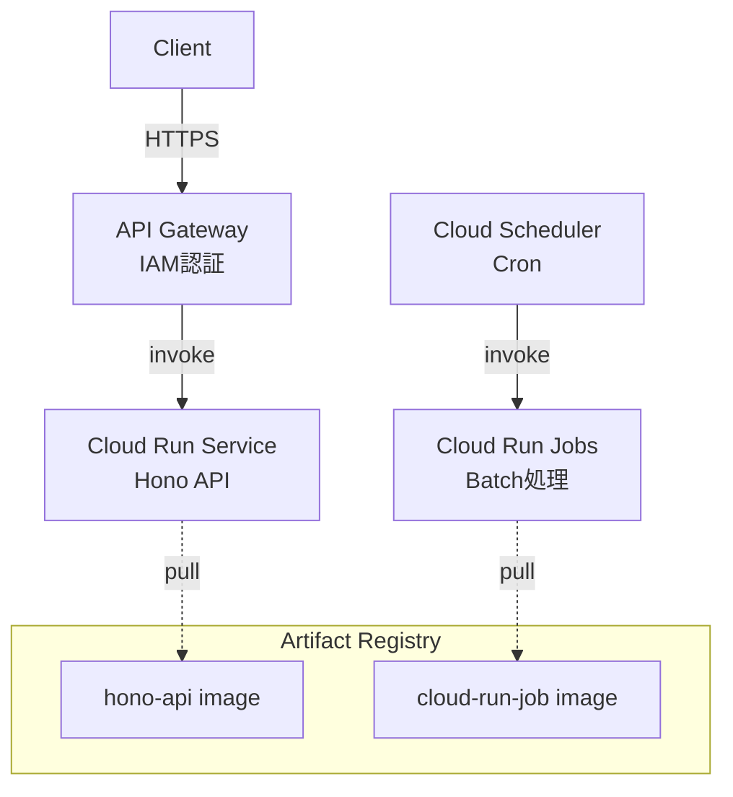

# cloudrun-hono-jobs-terraform

Cloud Run Service (Hono API) + Cloud Run Jobs + Cloud Scheduler を Terraform で管理するテンプレートリポジトリ。

## アーキテクチャ



## ディレクトリ構成

```
.
├── app/                  # Cloud Run Service (Hono API)
│   ├── src/
│   │   ├── index.ts      # エントリポイント
│   │   └── routes/       # APIルート
│   ├── Dockerfile
│   └── package.json
├── jobs/                 # Cloud Run Jobs (バッチ処理)
│   ├── src/
│   │   └── index.ts      # ジョブエントリポイント
│   ├── Dockerfile
│   └── package.json
├── terraform/            # インフラ定義
│   ├── main.tf
│   ├── variables.tf
│   ├── outputs.tf
│   └── openapi.yaml.tpl
├── docker-compose.yml
└── Makefile
```

## セットアップ

### 前提条件

- Node.js 22+
- Google Cloud SDK (`gcloud`)
- Terraform
- direnv（推奨）

### 手順

```bash
# 1. 環境ファイルの作成
make setup
# .env を編集して PROJECT_ID を設定

# 2. direnv を有効化
direnv allow

# 3. ローカル依存関係のインストール
make local-install

# 4. Terraform 初期化
make init

# 5. デプロイ（Registry作成 → ビルド → Terraform apply）
make deploy
```

## 開発

### ローカル開発（API）

```bash
make local
# http://localhost:8080 でHono APIが起動
```

### Docker Compose

```bash
docker compose up
```

## Makefile コマンド

| コマンド | 説明 |
|---|---|
| `make setup` | 環境ファイルの初期生成 |
| `make init` | Terraform 初期化 |
| `make deploy` | 全体デプロイ（API + Job） |
| `make deploy-app` | API のみデプロイ |
| `make deploy-job` | Job のみデプロイ |
| `make build-app` | API イメージのビルド |
| `make build-job` | Job イメージのビルド |
| `make plan` | Terraform plan |
| `make apply` | Terraform apply |
| `make destroy` | 全リソース削除 |
| `make local` | ローカルAPI起動 |
| `make run-job` | Cloud Run Job を手動実行 |
| `make test-health` | ヘルスチェック |
| `make test-hello` | hello エンドポイントテスト |
| `make outputs` | Terraform outputs 表示 |

## API エンドポイント追加

[app/src/routes/](app/src/routes/) にルートファイルを追加し、[app/src/index.ts](app/src/index.ts) で `app.route()` に登録。API Gateway 経由で公開する場合は [terraform/openapi.yaml.tpl](terraform/openapi.yaml.tpl) にもパスを追加。

## Job 追加

[jobs/src/index.ts](jobs/src/index.ts) の `switch` 文に新しいケースを追加。Terraform で新しい `google_cloud_run_v2_job` リソースと `google_cloud_scheduler_job` を定義してスケジュール設定。
